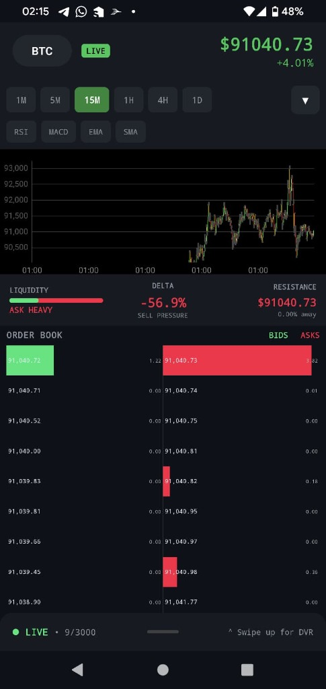

# 🔬 LiquidityLens - High-Performance Market Forensics

<div align="center">
  
  
  
  <br />
  
  
  
</div>

> **"Don't just watch the crash. Rewind it."**
>
> A high-frequency trading visualization tool that records and replays cryptocurrency order books in real-time. Built for **60fps performance** on mobile using a custom Zero-Garbage-Collection architecture.

<div align="center">
  
  
</div>

---

## 🚀 Engineering Highlights (Why I Built This)

This project was built to solve a specific systems engineering challenge: **How to render 10Hz high-frequency market data on a mobile device without battery drain or UI lag.**

### 1. Zero-Garbage-Collection Architecture (Android)
*   **Challenge**: Standard `ArrayList` and `RecyclerView` caused micro-stutters due to frequent Garbage Collection (GC) events when processing 10 updates/second.
*   **Solution**: Implemented a fixed-size **Ring Buffer** and object pooling. The app runs with **zero allocations** during the render loop, ensuring a locked **60fps**.

### 2. Custom Binary Protocol (Bandwidth Optimization)
*   **Challenge**: JSON payloads from Binance were too large (1.5KB/update) and CPU-intensive to parse on mobile.
*   **Solution**: Wrote a custom **Binary WebSocket Protocol**. The backend compresses updates into a **640-byte** binary blob (60% reduction), which the mobile app parses instantly using `ByteBuffer`.

### 3. Java 21 Virtual Threads (Backend)
*   **Challenge**: Handling thousands of concurrent WebSocket connections with traditional thread pools is resource-heavy.
*   **Solution**: Leveraged **Java 21 Virtual Threads** (Project Loom) to handle high-throughput concurrency with minimal memory footprint.

### 4. GPU-Accelerated Canvas Rendering
*   **Challenge**: Android's declarative UI (Compose) struggled to redraw complex order book depth charts at 60fps.
*   **Solution**: Bypassed the standard UI toolkit to draw directly to the **GPU using the Canvas API**, calculating heatmaps and depth curves in real-time.

---

## 🛠 Tech Stack


<br />

*   **Mobile**: Kotlin 2.0, Jetpack Compose, OkHttp (WebSockets), Android Canvas API.
*   **Backend**: Java 21, Spring Boot 3.3, Virtual Threads.
*   **Data Structure**: Circular Ring Buffer (O(1) access).
*   **Protocol**: Custom Binary Stream (ByteBuffer).

---

## 📸 Features

*   **Market DVR™**: Records the last 5 minutes of market data in RAM. Users can "scrub" backward in time to analyze flash crashes.
*   **Real-Time Heatmap**: Visualizes liquidity "walls" using color intensity.
*   **Order Book Imbalance**: Calculates buy/sell pressure in real-time.

---

## 🏆 Competitive Advantage

| Feature | 🔬 LiquidityLens | 🔶 Binance / Exchanges | ☁️ TradingView | 🗺️ Bookmap |
| :--- | :---: | :---: | :---: | :---: |
| **Platform** | **Mobile First** | Mobile & Desktop | Web & Desktop | Desktop Only |
| **Order Book Visibility** | **Full Depth (Visual)** | Basic List (Numbers) | None (on mobile) | Full Depth (Visual) |
| **Market Replay (DVR)** | **✅ Yes (5 min)** | ❌ No | ❌ No (Bar Replay only) | ✅ Yes (Paid) |
| **Performance** | **60 FPS Native** | Standard UI | Web-based | High Performance |
| **Price** | **Free / Open Source** | Free | Free / $15+ mo | $49 - $99 / mo |

---

## 🏃‍♂️ How to Run

### Backend
```bash
cd backend
./mvnw spring-boot:run
```

### Android App
1. Open `liquidity-lens-app` in Android Studio.
2. Sync Gradle.
3. Run on Emulator or Physical Device.

---

## 📄 License

MIT License. Open Source.
